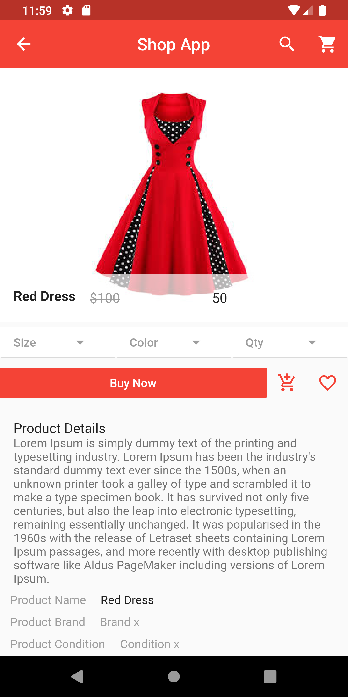
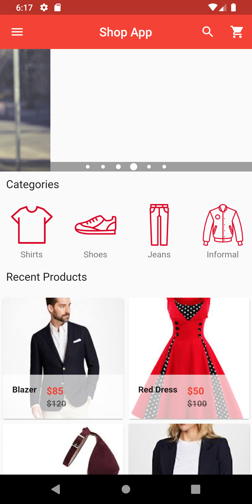
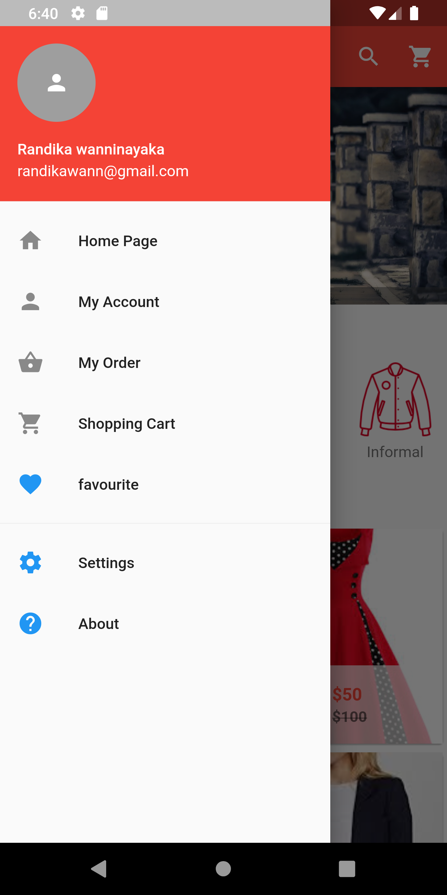

# flutter_app_second

second flutter appplication about about shoping applicatoin

## Getting Started

This project is a starting point for a Flutter application.

### master branch

### 01drawer branch

### 02carouselhome branch

 

### 03gridview branch

### 04route branch

### 05proddetails branch

### 06cart branch

 

### master screens

   
